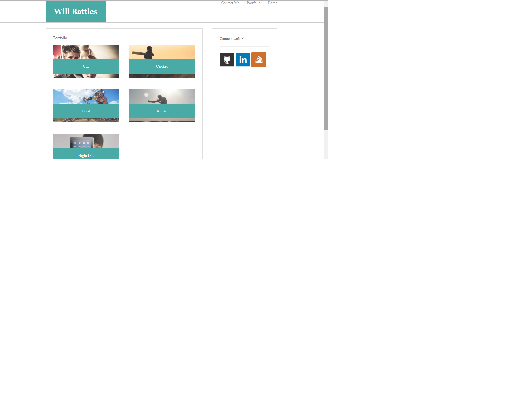
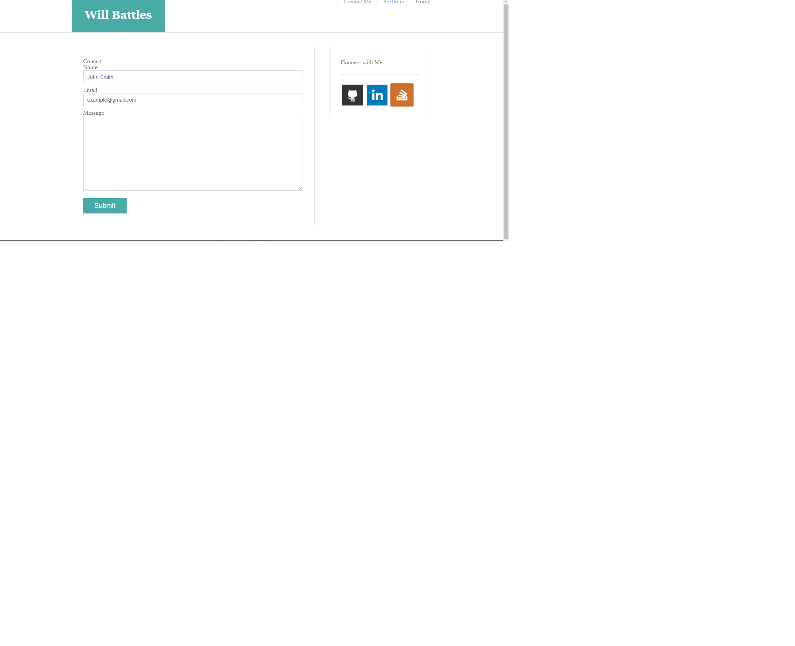

# Basic-Portfolio

This is the first homework assignment for the UT Coding bootcamp for the Sept class of 2017.

This is a basic portfolio using only HTML and CSS framework.

It was created using three seperate HTML files and one CSS file for the formatting.  No other packages were used.

1) The below screen shot is the index page/home page.

2)  The below screen shot is the portfolio page.

3) The below screen shot is the contact me page.

